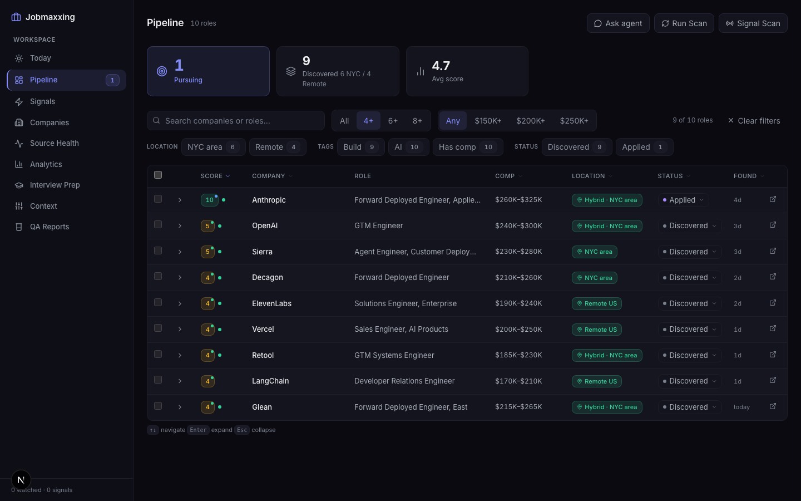
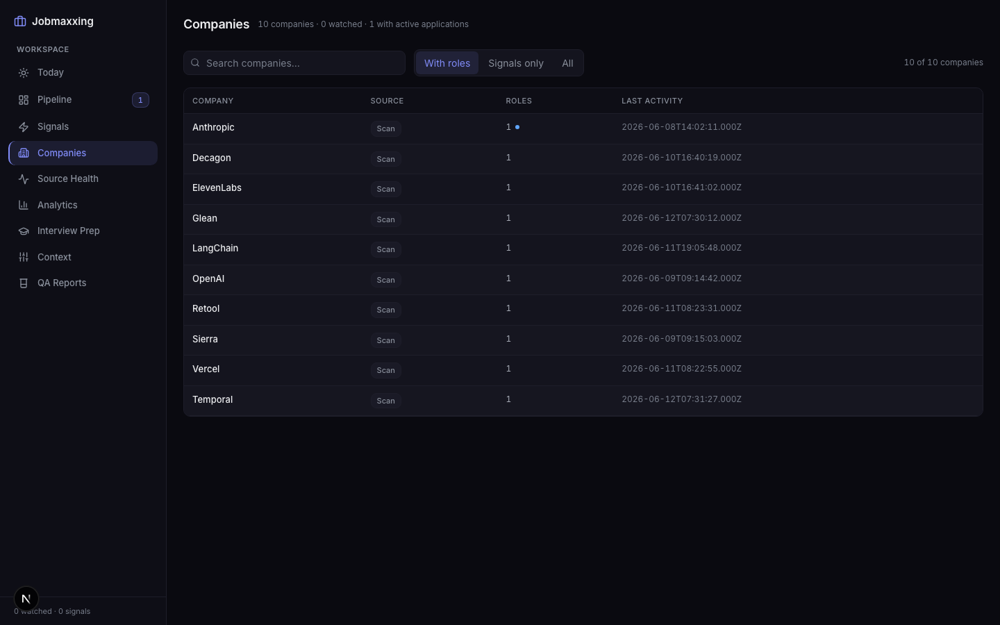

# Jobmaxxing

**An AI-native job search command center, built on Claude Code.**

Built by a GTM engineer, for GTM engineers, forward-deployed engineers, and solutions engineers — but every archetype is YAML config, so you can point it at backend, product, design, or anything else in ten minutes.

<p align="center">
  
</p>

## What it does

Jobmaxxing runs a continuous **scan → score → decide** loop over the job market so you spend your time on the handful of roles worth pursuing:

- **Scans** ATS portals (Ashby, Greenhouse, Lever, Wellfound) for 45+ pre-configured companies plus your own list — zero-token API discovery, optional Playwright liveness verification
- **Scores every role** against *your* calibration: a `user-context.yaml` with archetype qualification gates, a hard comp floor, location clusters, and per-company boost/penalize/block overrides — not keyword matching
- **Detects hiring signals** — a company hiring a VP of Sales is about to hire GTM engineers; signal scans surface that before the job posting exists
- **Briefs you daily** — an agent-generated morning briefing of what moved: new high-scoring roles, stalled applications, follow-ups due
- **Runs a web dashboard** with pipeline, companies, signals, source health, analytics — and an embedded agent chat (⌘K) that can query your pipeline, kick off scans, and read your prep docs
- **Drafts applications** — AutoApply fills ATS forms from your profile and resume library with a human-in-the-loop review on every submission
- **Evaluates deeply on demand** — paste a JD into Claude Code, get a structured evaluation, tailored ATS-optimized PDF CV, and tracker entry

> **This is a filter, not a spray-and-pray tool.** The scoring engine exists to tell you which 5 of 500 roles deserve your attention. Nothing is ever submitted without your review.

<p align="center">
  
</p>

## Who it's for

The default archetypes target the AI-adjacent go-to-market engineering space: **GTM Engineer, Forward Deployed Engineer, Solutions Architect, Agent Engineer, LLMOps**. The seed company list (`config/companies.yml`) covers AI labs, agent startups, and dev-tool companies hiring those roles.

None of that is hardcoded. Archetypes, scoring weights, disqualifiers, comp floor, and target companies all live in YAML — ask Claude Code to rewrite them for your field and the whole pipeline recalibrates.

## Quick Start

```bash
# 1. Clone and install
git clone https://github.com/nick-ruzicka/jobmaxxing.git
cd jobmaxxing && npm install
npx playwright install chromium   # Required for PDF generation + scan verification

# 2. Check setup
npm run doctor

# 3. Configure — copy each template to its real name, then edit with your details
cp config/profile.example.yml config/profile.yml
cp config/user-context.example.yaml config/user-context.yaml   # Scoring calibration
cp templates/portals.example.yml portals.yml                   # Companies to scan
cp data/applications.example.md data/applications.md
cp data/score-overrides.example.json data/score-overrides.json
cp data/seen-urls.example.json data/seen-urls.json
cp data/enrichments.example.json data/enrichments.json
cp interview-prep/story-bank.example.md interview-prep/story-bank.md

# 4. Add your CV
cp cv.example.md cv.md            # Then replace with your CV in markdown

# 5. Personalize with Claude
claude   # Open Claude Code in this directory
# "Change the archetypes to backend engineering roles"
# "Set my comp floor to $180K and rescore"
# "Add these 5 companies to my scan list"

# 6. Scan and score
npm run scan
```

### Web dashboard

```bash
cd dashboard-web
npm install
npm run dev        # http://localhost:3000
```

Pipeline, companies, signals, source health, analytics, interview prep — plus the agent chat (⌘K from any page). There's also a Go TUI (`dashboard/`) if you prefer the terminal.

## How it works

```
        scan portals + signal scans          (cron or on-demand, zero-token API discovery)
                    │
                    ▼
        enrichment + scoring engine          (Claude classification × your user-context.yaml:
                    │                         archetype gates, comp floor, location clusters,
                    │                         score overrides — full provenance per score)
                    ▼
        pipeline + daily briefing            (web dashboard, agent chat, morning brief)
                    │
                    ▼
        evaluate → PDF → apply               (deep eval, tailored ATS CV, AutoApply
                                              with human review on every submission)
```

Everything is local: markdown tables, YAML config, and JSON state on your machine. Your data goes to the AI provider you configure and nowhere else.

## Claude Code commands

Inside `claude`, the pipeline is driven by slash commands (the `/career-ops` naming is inherited from upstream and kept for compatibility):

```
/career-ops {paste a JD}   → Full pipeline: evaluate + PDF + tracker
/career-ops scan           → Scan portals for new roles
/career-ops batch          → Batch-evaluate in parallel with sub-agents
/career-ops pdf            → Generate ATS-optimized CV
/career-ops deep           → Deep company research
/career-ops tracker        → Application status
```

Gemini CLI and OpenCode are also supported — same modes, same evaluation logic. See [docs/SETUP.md](docs/SETUP.md).

## Project structure

```
jobmaxxing/
├── AGENTS.md               # Canonical agent instructions (all CLIs)
├── config/
│   ├── user-context.example.yaml   # Your scoring calibration (the brain)
│   ├── archetypes.yaml              # Role archetypes + qualification gates
│   └── companies.yml                # Seed scan list
├── modes/                  # Evaluation skill modes (evaluate, scan, pdf, batch…)
├── scripts/                # Scan, scoring, enrichment, briefing, signal engines
├── dashboard-web/          # Next.js dashboard + agent chat
├── dashboard/              # Go TUI (Bubble Tea)
├── autoapply/              # ATS form-filling harness (human-in-the-loop)
├── interview-prep/         # STAR+R story bank (template provided)
└── data/                   # Your pipeline state (gitignored)
```

## Companion project

- **[CohortQA](https://github.com/nick-ruzicka/cohortqa)** — persona-based QA harness extracted from this project: simulated user cohorts stress-test the pipeline and dashboard.

## Credits

Jobmaxxing started as a fork of [`santifer/career-ops`](https://github.com/santifer/career-ops) by [Santiago Fernández de Valderrama](https://santifer.io). The evaluation modes, ATS PDF generation, portal scanner core, and Go TUI come from his excellent upstream work — if you want the original, leaner system, [go star it](https://github.com/santifer/career-ops). This fork adds the scoring engine, signal scans, web dashboard + agent chat, daily briefings, AutoApply, and the analytics layer.

## Disclaimer

**Jobmaxxing is a local, open-source tool — NOT a hosted service.** By using it you acknowledge:

1. **You control your data.** Your CV and personal data stay on your machine and are sent only to the AI provider you configure. Nothing is collected by this project.
2. **You control the AI.** Default prompts forbid auto-submitting applications, but AI models can behave unpredictably — always review AI-generated content before submitting.
3. **You comply with third-party ToS.** Use this tool in accordance with the terms of the portals you interact with. Don't spam employers or overwhelm ATS systems.
4. **No guarantees.** Evaluations are recommendations, not truth. The authors are not liable for employment outcomes or any other consequences.

See [LEGAL_DISCLAIMER.md](LEGAL_DISCLAIMER.md) for full details.

## License

[MIT](LICENSE) — original work © Santiago Fernández de Valderrama, fork modifications © Nick Ruzicka.
